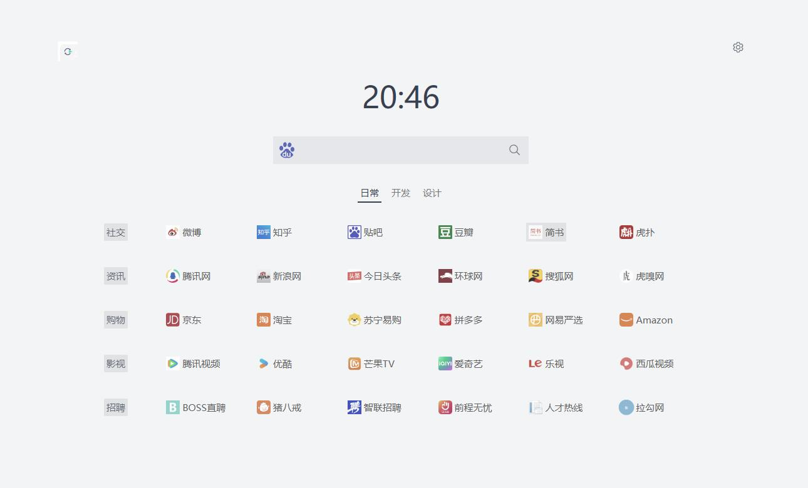

# NavSync

一款极简的网址导航工具，基于 [COME COME](https://github.com/hellojuantu/comecome) 改进，支持云端同步，部署在 Cloudflare Pages，**站点图标直接走 0x3**（无需代理、KV、环境变量）。



## 功能

- 个性主题切换（月白、初春、瀚海、大漠）
- 网址与分类自定义（鼠标拖动排序，分类即顶部的二级导航标签）
- 搜索引擎自定义（内置百度、必应、谷歌、搜狗、维基百科，也可自行增删改）
- 搜索词自动提示
- 图标风格切换（鲜艳、朴素、灰白）
- 色彩模式切换（系统自动、夜间模式、日间模式）
- 导入、导出数据
- **云端同步**（基于 GitHub Gist + Cloudflare Pages Functions）
- **访问口令保护**（Token 存储在服务端环境变量中，前端不可见）
- **暴力破解防护**（5 次口令错误后锁定 15 分钟）
- **跨设备自动同步**（换设备后自动查找云端已有配置，无需手动同步 ID）
- **壁纸与外观设置**（站长和访客都可设置皮肤、强调色、本地图片、图片 URL、渐变、透明度、模糊和玻璃效果）
- **壁纸文件夹随机播放**（授权一个本地文件夹后，点页面右下角的小风车即可随机换一张）
- **站点布局自定义**（每页行数 / 列数、行间距 / 列间距，以及图标大小、圆角、透明度）
- **Favicon 懒加载**（新增网站后自动按域名获取独立 Favicon，上游请求 128x128，页面按 `--wallpaper-icon-size` 渲染（默认约 71.7px，可调 25.6px ~ 89.6px），加载失败回退首字母彩色图标）
- **Favicon 代理 + KV 缓存**（后端统一代理第三方图标源，KV 缓存 30 天，同一域名仅回源一次）
- **站长 / 访客双身份**（站长可编辑与同步，访客全程只读，且直接看到站长云端配置的导航页；壁纸属于各自设备的本地外观设置）

---

## 站长 / 访客权限模型

站长与访客共用同一个网址，靠访问口令 `CLOUD_PASSWORD` 区分身份。

| | 站长（知道口令） | 访客（其他所有人） |
| --- | --- | --- |
| 首页内容 | 自己的导航（本地 + 云端） | 站长已上传到云端的导航 |
| 设置齿轮 | 可见 | **不可见** |
| `/setting` | 完整设置页 | 只有一个口令输入框 |
| 云端同步 / 重置 / 导入导出 | 可用 | **完全不渲染** |
| 增删改站点、拖拽排序 | 可用 | **不可用（只读）** |
| 壁纸、皮肤、透明度、玻璃效果 | 可用 | 可用（仅保存在当前设备） |

工作原理：

```
站长本地编辑 → 「上传到云端」(需口令) → GitHub Gist
                                          ↓
                         /api/public-config（只读、无需口令）
                                          ↓
                                    访客首页渲染
```

- 访客通过 `GET /api/public-config` 拿到站长的导航数据，该接口**只读**、不返回任何凭据，也无法写入
- 所有写操作（`/api/upload`、`/api/download`、`/api/find-gist`）仍然强制校验口令，即便有人伪造前端状态也改不了数据
- 站长身份标记只在服务端口令校验通过后写入，且每次打开页面都会复验一次

> ⚠️ **务必设置 `CLOUD_PASSWORD`。** 留空时口令校验整体跳过，任何人都能进入设置页并覆盖你的配置。

**站长改动后记得点一次「上传到云端」**，访客端才会看到导航内容更新（公开接口有 60 秒边缘缓存）。

壁纸和外观属于本地设备设置：站长和访客都可以在**桌面端**点击顶部右侧的壁纸按钮独立设置，不会覆盖对方的壁纸，也不会通过导航数据同步。（窄屏下这个按钮会隐藏，移动端只保留站长可见的设置齿轮。）

新增网站时留空自定义图标地址，系统会根据网站域名自动获取对应 Favicon；上游按 128x128 请求，页面按外观面板里的「图标大小」渲染。若某个站点不支持图标，会回退显示彩色首字母。

设置页底部的「退出管理（查看访客视角）」可以随时切回访客只读视图做自检。

---

## 一键部署

### 前置条件

- 一个 GitHub 账号
- 一个 Cloudflare 账号（免费即可）

整个过程约 10 分钟，无需服务器、无需域名、无需付费。

### 第一步：Fork 仓库

点击 GitHub 仓库右上角的 **Fork** 按钮，将项目复制到你的账号下。

> 仓库地址：[yk2516/NavSync](https://github.com/yk2516/NavSync)

Fork 完成后，你会在 `https://github.com/<你的用户名>/NavSync` 拥有一份完整副本。

### 第二步：获取 GitHub Token

GitHub Token 用于后端代你操作 Gist（创建、读取、更新）。**仅需 `gist` 权限**，不需要其他权限。

1. 打开 [GitHub Settings → Developer settings → Personal access tokens → Tokens (classic)](https://github.com/settings/tokens)
2. 点击 **Generate new token (classic)**
3. 填写以下信息：
   - **Note**（备注）：随便写，如 `NavSync Cloud Sync`
   - **Expiration**（有效期）：按需选择
   - **Scopes**（权限）：**只勾选 `gist`**，其他都不勾
4. 点击页面底部的 **Generate token**
5. 复制生成的 Token（格式类似 `ghp_xxxxxxxxxxxx`），**页面关闭后无法再看到**

> 也可以直接点击这个快捷链接，会自动帮你选好 `gist` 权限：
> [创建 Token（预设 gist 权限）](https://github.com/settings/tokens/new?description=NavSync%20Cloud%20Sync&scopes=gist)

### 第三步：（已移除）创建 KV 命名空间

2026-09-18 改造：站点图标从「CF Function 代理 + KV 缓存」改成**浏览器直接 `` 调 0x3**，
不再需要 KV 命名空间。如果你之前为旧版本创建过 `navsync-favicon` 命名空间，**可以直接删掉**；
旧的 `FAVICON_KV` 绑定也建议从 Pages 项目里解绑（Settings → Bindings → 删除），不会报错但多余。

> 0x3 在国内可直接访问，没有 CORS 限制（`` 标签不受 CORS 约束）。
> 代价是 0x3 只返 **32×32** PNG，2 倍屏上图标比之前的 128px 源略糊。
> **速度优先于像素清晰度是这次改造的取舍**。

### 第四步：在 Cloudflare Pages 部署

> 以下路径按 Cloudflare **中文界面** 写法，英文界面可对照括号里的英文。

1. 回到 **Workers 和 Pages**，点击 **创建应用程序**（Create）→ 选择 **Pages** → 点击 **连接到 Git**（Connect to Git）
2. 注意选的是 Pages，不是 Workers。页面底部有一行小字链接，点击可切换类型
3. 授权 Cloudflare 访问你的 GitHub，选择你 Fork 的 `NavSync` 仓库
4. 填写构建设置：
   - **框架预设**（Framework preset）：`Vue`
   - **构建命令**（Build command）：`npm run build`
   - **构建输出目录**（Build output directory）：`dist`
5. 展开底部的 **高级**（Advanced）设置，配置以下变量。**只剩两个环境变量**（favicon 已迁出，无需 KV 绑定）：

   **环境变量**（Environment variables）：

   | 变量名 | 必填 | 说明 | 示例值 |
   | --- | --- | --- | --- |
   | `GITHUB_TOKEN` | **是** | 第二步获取的 GitHub Token，仅需 `gist` 权限 | `ghp_xxxxxxxxxxxx` |
   | `CLOUD_PASSWORD` | **强烈建议** | 管理口令。同时用于云端同步鉴权和管理入口验证；留空则任何人都能编辑和同步 | `myStr0ngP@ssw0rd` |

   > 必填的只有 `GITHUB_TOKEN`。
   > `CLOUD_PASSWORD` 虽然技术上可选，但**强烈建议设置**——否则任何人都能进入设置页修改你的导航配置。

### 第五步：等待部署完成

Cloudflare 会自动拉取代码、安装依赖、构建并部署。通常 2-3 分钟内完成。

部署成功后，你会得到一个 `https://your-project.pages.dev` 的地址。也可以在 Pages 项目的 **自定义域**（Custom domains）中绑定自己的域名。

### 第六步：开始使用

1. 打开你的网站地址
2. 点击右上角设置齿轮进入设置页
3. 在云端同步区域输入你设置的 `CLOUD_PASSWORD`，点击验证
4. 验证通过后点击「上传到云端」即可同步配置
5. 换设备时，重复上述步骤后点击「从云端拉取」，会自动查找并下载你之前上传的配置

> 如果未设置 `CLOUD_PASSWORD` 环境变量，则无需口令即可同步（不推荐，任何人都能操作）。
> 连续 5 次口令错误后，该 IP 将被锁定 15 分钟。

**访客**打开同一个网址时，会直接看到站长已上传到云端的导航页面（只读），看不到设置入口，也无法编辑。

---

## 环境变量速查

部署步骤已包含完整配置。以下是常见疑问速查：

| 问题 | 回答 |
| --- | --- |
| `GITHUB_TOKEN` 在哪设置？ | Pages 项目 → **设置 → 环境变量**（Settings → Environment variables）→ 添加；或部署向导的 **高级**（Advanced）区域 |
| `CLOUD_PASSWORD` 不设置会怎样？ | 不启用口令保护，任何人都能同步你的配置、进入设置页。**强烈建议设置** |
| 站点图标怎么来的？ | 浏览器直接 `` 加载 `https://0x3.com/icon?host={域名}`。无需任何 Cloudflare 配置；旧版本里若还留着 `FAVICON_KV` 绑定，可以安全删掉 |

---

## 本地开发

```bash
# 安装依赖
npm install

# 启动开发服务器（默认 http://localhost:5173）
npm run dev

# 构建生产版本（输出到 dist/）
npm run build

# 预览构建结果
npm run preview
```

> 本地开发时，Cloudflare Pages Functions（`/api/*`）不会运行。如需调试 API，建议用 `npx wrangler pages dev dist` 或直接部署到 Cloudflare Pages 预览环境。

---

## 常见问题

**Q: 部署后打开网站白屏？**

检查 Cloudflare Pages 的部署日志（Deployments → 点击具体的部署 → 查看构建日志）。常见原因：
- `GITHUB_TOKEN` 未设置或无效 → 不影响首页加载，但云端同步功能不可用
- 构建失败 → 确认构建命令是 `npm run build`、输出目录是 `dist`

**Q: 访客打开网站看到的是内置的默认导航页，不是我的配置？**

站长需要先在设置页点一次「上传到云端」。访客首页通过 `/api/public-config` 拉取站长云端配置，如果云端还没有数据，就会回退到内置预设页面。

**Q: 站长修改了导航但访客没看到更新？**

公开接口有 60 秒边缘缓存。等一分钟后刷新即可。也可以在 Cloudflare Dashboard 手动清除缓存。

**Q: 忘记了 `CLOUD_PASSWORD` 怎么办？**

去 Cloudflare Pages 项目的 **设置 → 环境变量** 中查看或重置。口令存储在服务端，前端无法查看。

**Q: 怎么让访客也能编辑？**

不能。访客模式是只读的，这是设计如此。如果你想给别人编辑权限，把 `CLOUD_PASSWORD` 告诉对方即可——知道口令的人就是站长。

---

## 技术栈

- Vue 3 + TypeScript + Vite
- Pinia（状态管理）
- UnoCSS（原子化 CSS）
- Naive UI（组件库）
- Cloudflare Pages Functions（后端 API）
- GitHub Gist（云端存储）

## 项目结构

```
├── functions/          # Cloudflare Pages Functions（后端）
│   ├── _shared.ts      # 共享工具：口令校验、限流、Gist 操作
│   ├── api/            # 挂在 /api/* 下的接口
│   │   ├── status.ts          # GET  /api/status          — 服务状态
│   │   ├── verify-password.ts # POST /api/verify-password — 口令验证
│   │   ├── find-gist.ts       # GET  /api/find-gist       — 查找配置 Gist
│   │   ├── upload.ts          # POST /api/upload          — 上传配置
│   │   ├── download.ts        # GET  /api/download        — 下载配置
│   │   ├── public-config.ts   # GET  /api/public-config   — 访客只读配置
│   │   └── user.ts            # GET  /api/user            — GitHub 用户信息
│   └── favicon/[id].ts        # GET  /favicon/{域名}.png  — 图标代理 + KV 缓存
│                              #     注意：路由是 /favicon/，不在 /api/ 下
├── src/                # 前端源码
│   ├── stores/         # Pinia stores（admin / viewer / wallpaper / site / setting / ...）
│   ├── composables/    # 组合式函数（bootstrap / dark / ...）
│   ├── utils/          # 工具函数（cloud / publicConfig / favicon / ...）
│   ├── pages/          # 页面（只有 home）
│   │   └── home/       # 首页；/setting 是它内部用 <route> 块声明的子路由，
│   │                   #   渲染 Blank.vue 占位，用于访客停在口令输入界面
│   └── components/     # 组件
├── public/             # 静态资源
├── .env.example        # 环境变量配置参考
└── package.json
```

## 致谢

- [COME COME](https://github.com/hellojuantu/comecome)
- [Moon-Web-Start](https://github.com/jic999/moon-web-start)
- [0x3](https://0x3.com)

## License

MIT
